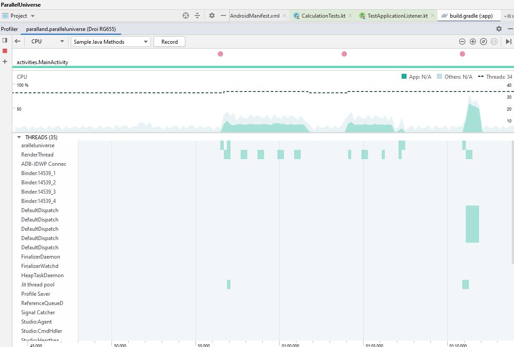

# paralland

This is an example for parallel programming on android. It is taking the classical example of calculating pi in a huge number of steps. 
If you run it on different devices and look at it in cpu-profiler in Android Studio you can see how the threads are really running in parallel when using Kotlin coroutines. 
Also suggestions for unit tests for the calculations are present.
You are very welcome to contribute!

## License

Paralland Project is published under GNU General Public License 3

## Screenshots

| Android       |
| ------------- |
||

| Android Studio Profiler       |
| ------------- |
||
